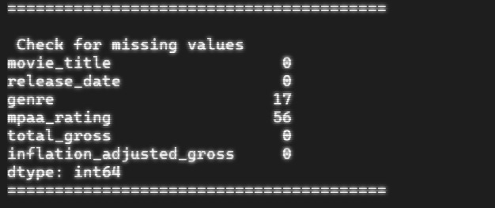
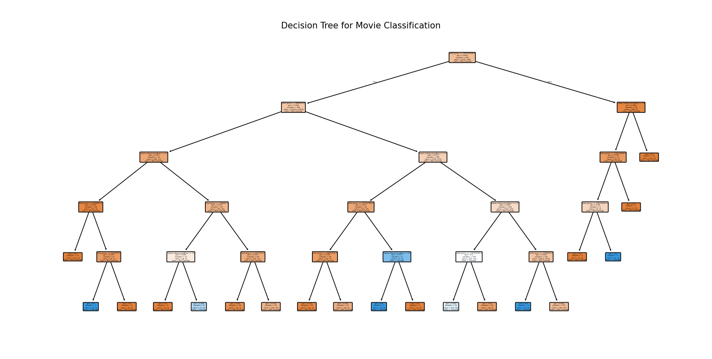

# **DisneyMovieInsights: Data Analytics and Machine Learning Project**

This project explores data analytics and machine learning techniques applied to a Disney dataset sourced from Kaggle. The goal is to analyze trends and develop predictive insights related to Disney movies. Please note that some steps are still in progress.

---

## **Table of Contents**

1. [Dataset Overview](#dataset-overview)  
2. [Data Cleaning](#data-cleaning)  
3. [Decision Tree Classifier](#decision-tree-classifier)  
4. [Addressing Model Overfitting](#addressing-model-overfitting)  
5. [Types of Classifiers](#types-of-classifiers)  
6. [Association Rules with the Apriori Algorithm](#association-rules-with-the-apriori-algorithm)  
7. [Visualizations](#visualizations)  
8. [Project Goals](#project-goals)  
9. [Acknowledgments](#acknowledgments)  

---

## **1. Dataset Overview**

The dataset includes details about Disney movies, such as:
- Release years  
- Genres  
- Production budgets  
- Revenues  
- Ratings  

**Key Step**: Data preparation and cleaning were essential to ensure the dataset was ready for analysis.

---

## **2. Data Cleaning**

Steps for data cleaning:
- Filled missing values.  
- Ensured consistency in categorical data.  
- Prepared the data for machine learning tasks.

---

## **3. Decision Tree Classifier**

### **Objective**  
Classify the genre of a Disney movie based on its **MPAA rating** and **release year**.

### **Steps**
1. Encode categorical variables like `MPAA rating`.  
2. Select relevant features such as `release year` and `MPAA rating`.  
3. Train a decision tree classifier using the cleaned dataset.  

### **Visualization**  
- The decision tree plot illustrates the splitting criteria and movie classification.

The Visualisation above shows that there are potential issues. The potential issues are:
1. Overfitting: The tree has too many speicfic splits
2. The visualisation above was just a test, however it does use unimportant features

---

## **4. Addressing Model Overfitting**

### **Objective**  
Forecast a movie's gross revenue using features like `release date`, `genre`, and `MPAA rating`.

### **Techniques to Mitigate Overfitting**
1. **Pruning**: Reduce tree complexity by limiting depth.  
2. **Cross-Validation**: Use k-fold cross-validation to improve generalizability.  
3. **Regularization**: Apply penalties to overly complex models during regression.  

---

## **5. Types of Classifiers**

### **Binary Classifier**  
- **Use Case**: Identify if a movie is an "Animated Feature" (Yes/No).

### **Multi-Class Classifier**  
- **Use Case**: Classify movies into multiple genres such as `Comedy`, `Adventure`, `Musical`, etc.

---

## **6. Association Rules with the Apriori Algorithm**

### **Use Case**  
Identify patterns between `genre` and `MPAA rating`.

### **Steps**
1. Convert data into a transactional format where each row contains attributes of a Disney movie (e.g., `genre`, `MPAA rating`).  
2. Use the Apriori algorithm to find frequent itemsets and generate association rules.  

### **Example Rule**  
*"If a movie is PG-rated, it is likely an Adventure."*

### **Metrics**
- **Support**: Frequency of an itemset.  
  Example: *30% of Disney movies are both PG-rated and Adventure.*  
- **Confidence**: Likelihood of a rule being true.  
  Example: *80% of PG-rated Disney movies are Adventure.*  
- **Lift**: Strength of the rule compared to random chance.  
  Example: *PG-rated movies are 1.5 times more likely to be Adventure.*  

---

## **7. Visualizations**

### **1. Decision Tree Visualization**  
- Graphically display splits based on features like `release year` and `MPAA rating`.

### **2. Support and Confidence Table**  
Below is an example of what we will do in this section:
| **Rule**                                      | **Support** | **Confidence** | **Lift** |
|-----------------------------------------------|-------------|----------------|----------|
| If a movie is **PG-rated**, it is likely an **Adventure** | 30%         | 80%           | 1.5      |
| If a movie is **G-rated**, it is likely a **Musical**       | 25%         | 70%           | 1.3      |
| If a movie is **R-rated**, it is likely an **Action**       | 20%         | 85%           | 1.8      |
| If a movie is **PG-13-rated**, it is likely a **Comedy**    | 15%         | 65%           | 1.2      |

---

## **8. Project Goals**

- Analyze trends in Disney movies.  
- Develop machine learning models to predict movie attributes and revenue.  
- Uncover patterns using association rule mining.

---

## **9. Acknowledgments**

This project uses the Disney dataset sourced from Kaggle.

